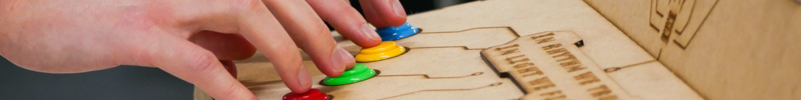
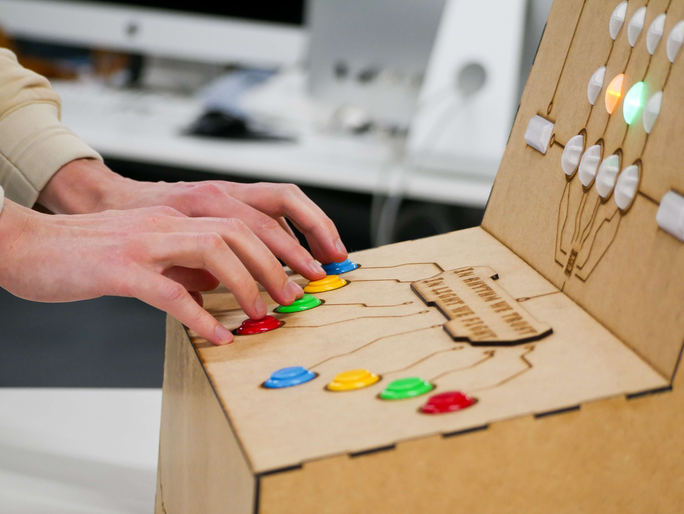
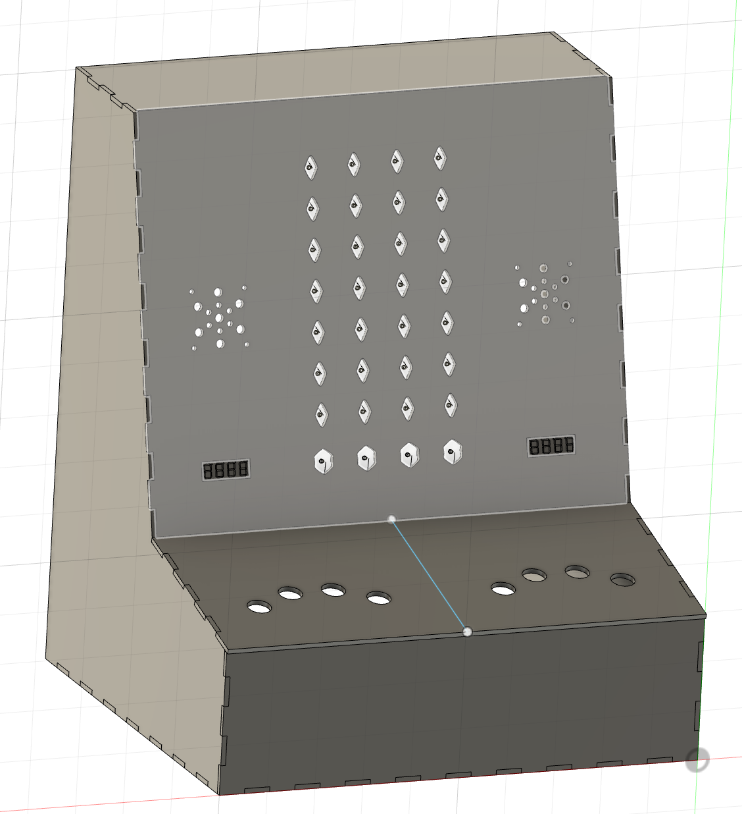
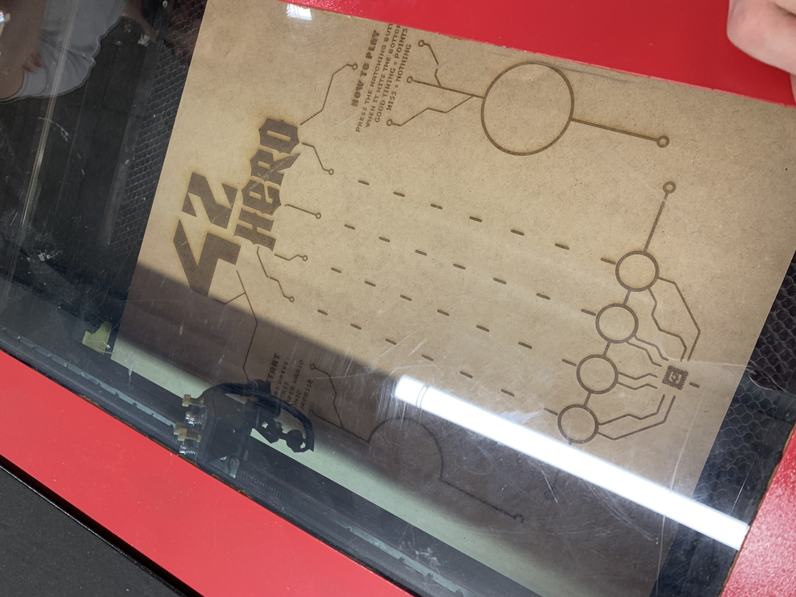
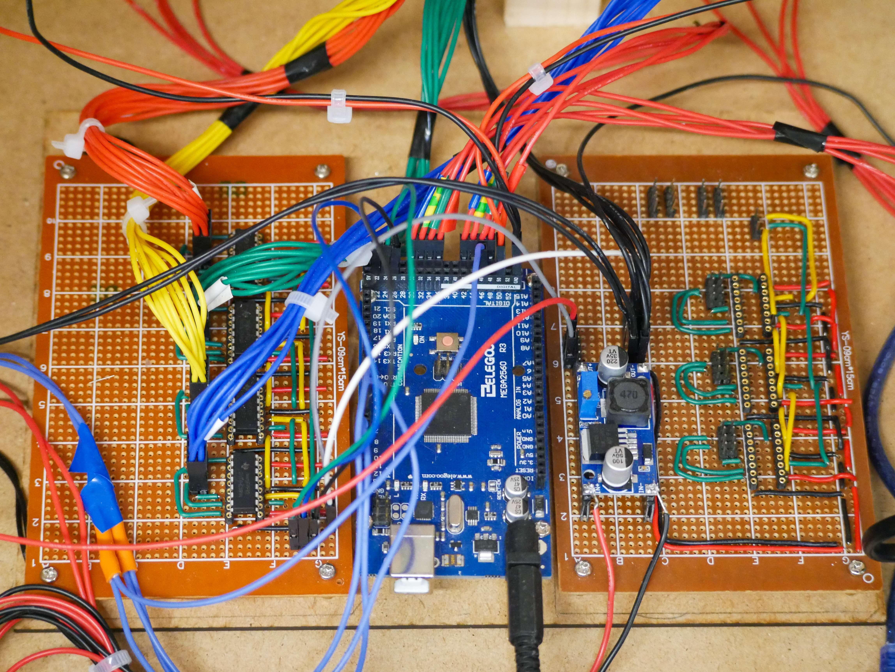
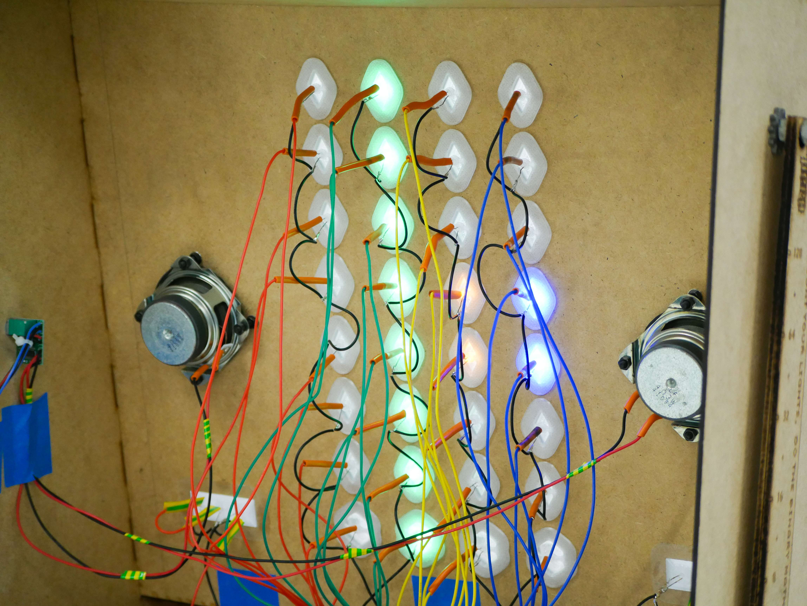

# 42Hero  
*Borne d’arcade rythmique embarquée — jeu physique, musique 8-bit, fabrication réelle.*

  

---

## 42Hero ?

42Hero est né au sein du **LabElec (42Chips)**, à l’occasion de la grande soirée d’inauguration du nouveau campus **42 Paris – 42Up**.

Lors d’une réunion du Lab, plusieurs idées de projets sont évoquées.  
Je n’ai, en théorie, pas le temps de m’engager sur un projet hors cursus.  
Mais cette idée-là reste sans volontaire.

Je lève la main.  
Puis, dans la semaine, deux camarades me rejoignent. Le projet est lancé.

L’idée est simple :  
prendre l’ADN de **Guitar Hero** et l’adapter à un **format arcade physique**, sans écran.

42Hero est une **mini-borne d’arcade rythmique deux joueurs**, conçue pour une seule chose :  
être **jouable immédiatement**, sans explication, sans friction.

- jouable en quelques secondes  
- lisible sans tutoriel  
- robuste face à un vrai public  
- amusante à jouer *et* à regarder  

La boucle de jeu est volontairement minimale :

> **appuyer au bon moment → voir et entendre immédiatement le résultat**

Aucune interface graphique, aucun menu complexe :  
tout passe par le **son**, les **LEDs** et le **rythme**.

Le projet met l’accent sur l’**expérience utilisateur physique**, la synchronisation temps réel et la fiabilité — pas sur une complexité logicielle décorative.

---

## Mon rôle & implications techniques

42Hero est un **projet embarqué de l’École 42**, réalisé en équipe de trois, avec une contrainte simple et brutale :  
**une deadline réelle, du public, et zéro droit à l’erreur visible**.

J’ai assuré une **grande partie de la direction technique et de l’expérience de jeu**, avec un objectif clair :  
**livrer une borne stable, lisible et fun**, pas un prototype “qui marche chez moi”.

Mon rôle a couvert :

- **Direction de conception de la borne** (forme, ergonomie, lisibilité)
- **Logique centrale de gameplay** (states, scoring, timing)
- **Système musical embarqué** : adaptation / réécriture de morceaux et intégration microcontrôleur
- **UX physique** : boutons, feedback LEDs, rythme, compréhension instantanée
- **Fabrication & intégration** : itérations, contraintes matérielles, tests réels

Ce projet a impliqué un **investissement massif sur une période courte**, au prix d’une quasi mise en pause de mon cursus commun — choix discutable, mais formateur.

En résumé :  
du **frontend**, sans écran, avec des fils, de la soudure…  
et une deadline qui ne négociait pas.

---

## Aperçu — Une vraie borne, pas une démo

  
   
  <em>Build final — compact, lisible, et prêt à encaisser de vrais joueurs.</em>

La borne a été conçue pour un contexte réel :  
inauguration, public varié, peu de temps pour expliquer.

Chaque choix répond à la même question :  
**“Est-ce que quelqu’un comprend et joue en moins de 10 secondes ?”**

---

## Gameplay — Du rythme lisible, avec feedback physique

  
   
  <em>Contrôles physiques + feedback LED : réponse immédiate, sans écran pour tricher.</em>

Le gameplay repose sur :

- une **boucle rythmique claire**
- une **logique d’états stricte**
- un **feedback instantané** (LEDs + son)

En embarqué, le timing n’est pas un détail :  
c’est **le cœur du jeu**.

Sans écran, toute la lisibilité passe par :
- la disposition physique
- le rythme visuel des LEDs
- la synchronisation sonore avec les actions du joueur

---

## Musique — Polyphonie 8-bit sur microcontrôleur

  
   
  <em>Réécriture de morceaux : la musique doit “rentrer” dans le microcontrôleur.</em>

La musique n’est pas un simple habillage :  
elle structure entièrement le gameplay.

- Réécriture de morceaux “jeu vidéo” en **partitions compatibles microcontrôleur**
- Lecture **polyphonique** via plusieurs timers hardware
- Synchronisation précise avec les événements de jeu

Ici, pas de piste audio pré-enregistrée :  
ce sont les **timers** qui pilotent le rythme et le feedback.

---

## Design & fabrication — Modélisation 3D pour le monde réel

  
   
  <em>Fusion 360 — design contraint par de vraies pièces, pas par un mockup.</em>

Pour obtenir une borne propre et assemblable :

- Modélisation complète sur **Fusion 360**
- Préparation des pièces pour **découpe laser** et **impression 3D**
- Itérations sur les tolérances, l’assemblage et l’intégration des composants

  
   
  <em>Du CAD au réel : là où les tolérances commencent à discuter.</em>

---

## Embarqué & intégration — Câbler, souder, débugger

  
   
  <em>Câblage et soudure : l’embarqué sans filtre.</em>

Une grande partie du projet est très **hands-on** :

- câblage
- soudure
- routage
- debug de bugs… qui n’existent que dans le monde réel

Ici, pas de démo sur breadboard :  
tout doit **tenir**, **fonctionner**, et **rester stable**.

---

## Deadline & arbitrages — Livrer sous contrainte

  
   
  <em>Le payoff : du gameplay stable en conditions réelles.</em>

La deadline d’inauguration a imposé des choix pragmatiques :

- abandon tardif de l’affichage 7-segments initialement prévu
- simplification du système de score
- priorité absolue à la **jouabilité** et à la **fiabilité**

Un vrai projet, ce n’est pas tout garder.  
C’est **savoir quoi sacrifier pour livrer quelque chose qui marche**.

---

## Tech stack

- **Microcontrôleur** : Arduino
- **Audio** : polyphonie via timers hardware
- **Électronique** : boutons, LEDs, amplification
- **Fabrication** : découpe laser, impression 3D
- **CAD** : Fusion 360

---

## Ce que montre ce projet

42Hero illustre :

- la conception d’une **expérience sans écran**
- la gestion du **temps réel** sous contraintes matérielles
- le lien direct entre **game design, UX et technique**
- la capacité à **livrer un produit stable**, en public, avec une vraie deadline

---

> Ce README est là pour montrer **la portée réelle du projet**,  
> les choix techniques, les compromis, et pourquoi **chaque décision impacte directement l’expérience de jeu**.
